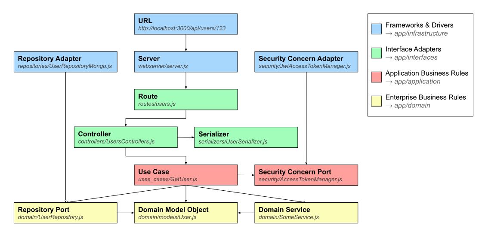

# CleanArchitecture

下記のリポジトリのまとめ

[jbuget/nodejs-clean-architecture-app](https://github.com/jbuget/nodejs-clean-architecture-app)

## Domain Driven Architectures

ソフトウェア設計は非常に難しいものです。
何年も前から、ビジネス ロジック、つまり (ビジネス) ドメインとユーザーをシステム全体の中心に置く傾向が現れています。
この概念に基づいて、さまざまなアーキテクチャ パターンが考案されました。

最初の主要なパターンの 1 つは、E. Evans がドメイン駆動設計アプローチで導入したものです。

これを基に、または同時期に、他の応用アーキテクチャが登場しました。

- オニオン アーキテクチャ (J. Palermo)
- ヘキサゴナル アーキテクチャ (A. Cockburn)
- クリーン アーキテクチャ (R. Martin)

## DDD and Clean Architecture

アプリケーションは、Uncle Bob の「[クリーン アーキテクチャ](https://blog.cleancoder.com/uncle-bob/2012/08/13/the-clean-architecture.html)」の原則とプロジェクト構造に従います。

Clean Architecture layers


## フロー制御

クリーンアーキテクチャを理解するのに一番分かりやすかった図



## プロジェクト構造

```zsh
app
├── lib
│   ├── application
│   │   ├── security
│   │   │   └── AccessTokenManager.js
│   │   └── use_cases
│   ├── domain
│   │   ├── Aggregates
│   │   ├── Entities
│   │   ├── ValueObjects
│   │   └── repositories
│   ├── infrastructure
│   │   ├── config
│   │   │   └── service-locator.js
│   │   ├── orm
│   │   │   ├── mongoose
│   │   │   └── sequelize
│   │   ├── repositories
│   │   ├── security
│   │   │   └── JwtAccessTokenManager.js
│   │   └── webserver
│   │       ├── oauth
│   │       └── server.js
│   └── interfaces
│       ├── controllers
│       ├── routes
│       └── serializers
├── node_modules (generated)
├── test
└── index.js
```

## 依存ルール

このアーキテクチャを機能させる最も重要なルールは、依存関係ルールです。
このルールは、ソースコードの依存関係は内側にしか向かないことを規定しています。
内側の円にあるものは、外側の円にあるものについて何も知ることができません。
特に、外側の円で宣言されたものの名前は、内側の円のコードで言及されてはなりません。

## Controllers

コントローラには 3 つの主な役割があります:

1. リクエストからパラメータ (クエリまたは本文) を抽出する
2. 適切なユースケースを呼び出す (アプリケーションレイヤー)
3. HTTP レスポンスを返す (ステータスコードとシリアル化されたデータを含む)

## Use Cases

ユースケースはビジネスロジックのユニットです。
これは、コントローラーによって呼び出される実行メソッドを持つ必要があるクラスです。
依存関係 (ポートオブジェクトの具体的な実装、つまりアダプター) または実行コンテキストを定義するコンストラクターを持つ場合があります。

※ユースケースには、正確なビジネス責任が 1 つだけ必要です。
ユースケースは、同じレイヤー (データリポジトリなど) またはドメイン レイヤー内のオブジェクトを呼び出すことができます。
